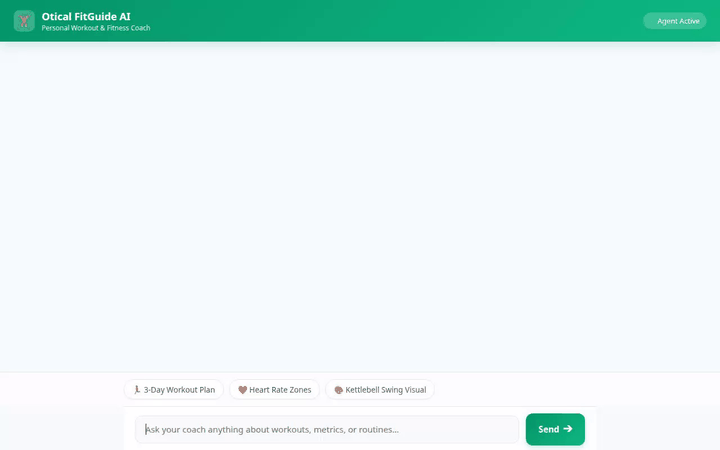

# 🏋️ Otical FitGuide AI - Personal Fitness Coach

An agentic fitness coach built with Google's Agent Development Kit (ADK) and deployed to Vertex AI Agent Engine. Otical FitGuide AI helps users plan custom routines, calculate training metrics, track completed workouts in Firestore, search RAG corpora for herbal lore, generate multimodal exercise visuals and videos, and render interactive UI surfaces via Adaptive UI (A2UI).

Full Video: https://www.youtube.com/watch?v=Egzqtc3wGO8



> 🎥 **Full WebM Demo Recording**: You can also watch the full HD WebM video recording in [`assets/fitguide_agent_demo.webm`](assets/fitguide_agent_demo.webm).

---

## 🌟 Implemented Features & Architecture

### 🧠 1. Cross-Session Memory Bank
- **Vertex AI Memory Bank Service**: Integrates `VertexAiMemoryBankService` to store and recall user preferences, health limitations, dietary restrictions, allergies, and exercise history across sessions.
- **Preload & Auto-Save**: Uses `PreloadMemoryTool` and `generate_memories_callback` to inject historical context into prompt instructions and automatically persist finished sessions into Vertex AI Memory Bank.

### ⚡ 2. Sandbox Code Execution
- **Vertex AI Agent Engine Sandbox**: Uses `AgentEngineSandboxCodeExecutor` to execute Python code safely in an isolated sandbox environment for precise fitness calculations:
  - **1-Rep Max (1RM)** estimation via Epley formula.
  - **Target Heart Rate (THR) Zones** via Karvonen formula (Zone 2 Aerobic Base & Zone 4 Threshold).
  - **Caloric Expenditure Estimates** based on MET intensity benchmarks.

### 💾 3. Google Cloud Storage & Firestore Databases
- **Google Cloud Firestore**:
  - `user_workout_logs`: Records completed workouts with duration, intensity, notes, and timestamps.
  - `workout_catalog`: Queries and saves custom workout routines filtered by category (`strength`, `endurance`, `hiit`, `core`) and level (`beginner`, `intermediate`, `advanced`).
- **Google Cloud Storage (GCS)**:
  - Stores and serves public media assets, form guides, generated images, and video files from a public GCS bucket (`fitguide-ai-media-b8f9ab32`).

### 🎨 4. Multimodal Generation (Imagen & Omni Video)
- **Imagen Visual Generation (`generate_fitness_item_image`)**: Generates exercise diagrams and fitness illustrations using Vertex AI in the `global` region. Saves artifacts via `tool_context.save_artifact` and uploads image bytes to Cloud Storage.
- **Omni Video Generation (`generate_fitness_item_video`)**: Generates short exercise animation demonstrations using `gemini-omni-flash-preview` in the `global` region, saving artifacts to the Playground panel and uploading video bytes to Cloud Storage.

### 🌿 5. RAG Corpus Search
- **Vertex AI RAG Engine (`query_herbal_rag_corpus`)**: Searches Nicholas Culpeper's *The Complete Herbal* RAG corpus (`projects/461062469766/locations/us-central1/ragCorpora/7625807986064424960`) to provide natural herbal remedies, recovery teas, and plant lore.

### 📍 6. External APIs & Geolocation
- **WGER Workout Manager API (`fetch_wger_exercises`)**: Fetches real exercise names, target muscle groups, and required equipment from the public WGER REST API.
- **Google Maps APIs (`geocode_address` & `find_nearby_places`)**: Geocodes user addresses and locates nearby gyms, fitness centers, and parks.

### 📱 7. Adaptive UI (A2UI) & Web Frontend
- **A2UI Schema Manager (v0.8)**: Generates structured JSON surface components (`Card`, `Column`, `Row`, `Text`, `Image`, `Divider`) rendered seamlessly by the frontend.
- **FastAPI Proxy & Web UI**: Minimal FastAPI backend (`frontend/main.py`) serving a responsive frontend (`frontend/static/index.html`) with example prompt chips, avatar bubbles, and theme styling.

---

## 📚 Complete Documentation & Deep Dives

For detailed technical specifications, architecture diagrams, build decisions, and deployment guides, refer to our comprehensive documentation suite in the [`docs/`](docs/) directory:

- 📐 **[System Architecture Diagram & Flow (`docs/ARCHITECTURE.md`)](docs/ARCHITECTURE.md)** — Detailed Mermaid flowcharts, sequence diagrams, and GCP service layout.
- 🛠️ **[Tools & API Reference Specification (`docs/API_AND_TOOLS.md`)](docs/API_AND_TOOLS.md)** — Complete 14-tool specifications, parameters, return schemas, and backend bindings.
- 📖 **[Build Journey & Design Rationale (`docs/BUILD_JOURNEY_AND_RATIONALE.md`)](docs/BUILD_JOURNEY_AND_RATIONALE.md)** — Step-by-step breakdown of how and why each component was built.
- 🚀 **[Production Deployment Guide (`docs/DEPLOYMENT_GUIDE.md`)](docs/DEPLOYMENT_GUIDE.md)** — Step-by-step CLI commands for Agent Engine and Cloud Run deployment.
- 🔗 **[Important Links & Resource Directory (`docs/IMPORTANT_LINKS.md`)](docs/IMPORTANT_LINKS.md)** — Live app URLs, GCP consoles, media links, reference guides, and resource IDs.

---

## 🛠️ Project Structure

```
fitguide-ai/
├── app/
│   ├── agent.py            # Main ADK Root Agent, tools, and callbacks
│   ├── a2ui_utils.py       # A2UI response parser & callback
│   └── __init__.py
├── assets/
│   └── fitguide_agent_demo.webm # Full HD WebM video recording
├── docs/
│   ├── ARCHITECTURE.md     # System flowcharts & sequence diagrams
│   ├── API_AND_TOOLS.md    # 14-tool specification catalog
│   ├── BUILD_JOURNEY_AND_RATIONALE.md # Step-by-step build rationale
│   ├── DEPLOYMENT_GUIDE.md # Vertex AI Agent Engine & Cloud Run guide
│   └── IMPORTANT_LINKS.md  # App URLs, GCP consoles, media & resource IDs
├── frontend/
│   ├── main.py             # FastAPI proxy server
│   └── static/
│       └── index.html      # Rebranded frontend UI with A2UI renderer
├── demo.gif                # Looping demo recording of FitGuide AI
├── agents-cli-manifest.yaml # Agent deployment manifest
└── README.md
```

---

## 🚀 Local Setup & Execution Instructions

### Prerequisites
- Python 3.10+
- Google Cloud SDK (`gcloud`) authenticated to your GCP project with Vertex AI, Firestore, and GCS permissions enabled.

### 1. Installation
Clone the repository and install the dependencies:
```bash
cd fitguide-ai
pip install -r requirements.txt
```

### 2. Environment Configuration
Set the required environment variables pointing to your Agent Engine resource and directory:
```bash
export AGENT_ENGINE_RESOURCE_NAME="projects/<PROJECT_ID>/locations/us-central1/reasoningEngines/<ENGINE_ID>"
export AGENT_DIRECTORY="app"
export PORT="8080"
```

### 3. Run the Frontend & Proxy Server Locally
Start the FastAPI application from the `frontend/` directory:
```bash
cd frontend
python main.py
```
The server will start listening locally on port `8080`.

---

## 📋 Deployment Summary

- **Agent Framework**: Google Agent Development Kit (ADK 1.1.0)
- **Deployment Target**: Vertex AI Agent Engine (`agent_runtime`)
- **Primary Model**: `gemini-2.5-flash`
- **Multimodal Models**: Imagen & `gemini-omni-flash-preview` (Global Region)
