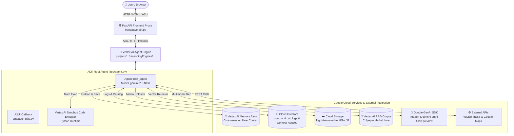
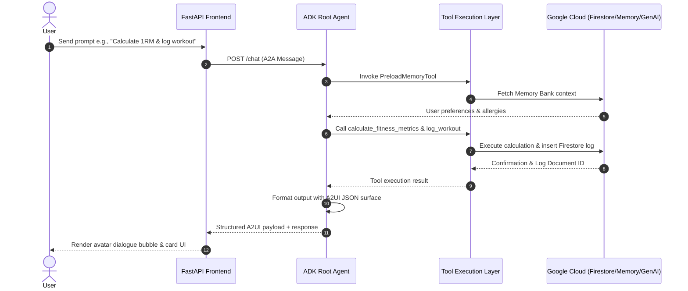

# 🏗️ Otical FitGuide AI - Code Architecture

This document provides a detailed overview of the system architecture, component layout, data flow, and Google Cloud platform integrations powering **Otical FitGuide AI**.

---

## 📐 System Architecture Diagram

---

## 🧩 Core Architectural Components

### 1. **ADK Root Agent (`app/agent.py`)**
- Built using **Google Agent Development Kit (ADK)**.
- **Model**: Powered by `gemini-2.5-flash` with automatic HTTP retry options.
- **System Prompt**: Generated via `A2uiSchemaManager` (v0.8) instructing the agent on dietary/allergy safety, workout planning, and structured A2UI surface rendering.

### 2. **State & Memory Management (`VertexAiMemoryBankService`)**
- Stores long-term memory across sessions.
- Injects user allergies, health restrictions, and past workout performance into context via `PreloadMemoryTool`.
- Automatically persists finished chat sessions back to Vertex AI Memory Bank via `generate_memories_callback`.

### 3. **Adaptive UI Engine (`app/a2ui_utils.py`)**
- Utilizes `A2uiSchemaManager` and `BasicCatalog`.
- Transforms raw JSON data structures into flat, accessible UI components (`Card`, `Column`, `Row`, `Text`, `Image`).
- `a2ui_callback` interceptor extracts structured data parts without leaking raw code blocks.

### 4. **Isolated Code Execution (`AgentEngineSandboxCodeExecutor`)**
- Safe, sandboxed Python code execution environment for complex mathematical formulas:
  - Epley 1RM formula: $1RM = W \times (1 + \frac{r}{30})$
  - Karvonen Heart Rate Reserve: $THR = HR_{rest} + (HR_{max} - HR_{rest}) \times \%Target$
  - Metabolic Equivalent of Task (MET) calorie burn calculations.

### 5. **Multimodal Visual & Video Generation**
- **Imagen Visuals**: Generates exercise form illustrations using `gemini-3.1-flash-lite-image` in the `global` region.
- **Omni Exercise Videos**: Generates short motion clips using `gemini-omni-flash-preview` in the `global` region.
- **Dual Pipeline**:
  1. Saves inline byte artifacts to the ADK Playground Artifacts panel (`tool_context.save_artifact`).
  2. Uploads public HTTPS objects directly to Google Cloud Storage (`fitguide-ai-media-b8f9ab32`).

---

## 🔄 Interaction Sequence Flow

